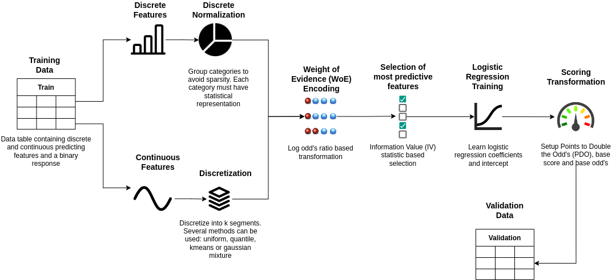

<div  id="top"></div>

  

[![Contributors][contributors-shield]][contributors-url]

[![Forks][forks-shield]][forks-url]

[![Stargazers][stars-shield]][stars-url]

[![Issues][issues-shield]][issues-url]

[![MIT License][license-shield]][license-url]

[![LinkedIn][linkedin-shield]][linkedin-url]

  

<h3  align="center">Credit Scoring Toolkit</h3>

  

<p  align="center">

In finance is a common practice to create risk scorecards to assess the credit worthiness for a given customer. Unfortunately, out of the box credit scoring tools are quite expensive and scatter, that's why we created this toolkit: to empower all credit scoring practicioners and spread the use of weight of evidence based scoring techniques for alternative uses cases (virtually any binary classification problem).

<br />
<a href="docs/build/html/index.html"><strong>Explore the documentation»</strong></a>
<br />
<a href="https://github.com/JGFuentesC/woe_credit_scoring/issues">Report Bug</a>

<a href="https://github.com/JGFuentesC/woe_credit_scoring/issues">Request Feature</a>
</p>
</div>
 


<details>
<summary>Table of Contents</summary>
<ol>
  <li><a href="#about-the-project">About The Project</a></li>
  <ol>
    <li><a href="#discretenormalizer">Discrete Normalizer</a></li>
    <li><a href="#discretizer">Discretizer</a></li>
    <li><a href="#woeencoder">WoeEncoder</a></li>
    <li><a href="#woebasefeatureselector">WoeBaseFeatureSelector</a></li>
    <li><a href="#woecontinuousfeatureselector">WoeContinuousFeatureSelector</a></li>
    <li><a href="#woediscretefeatureselector">WoeDiscreteFeatureSelector</a></li>
    <li><a href="#creditscoring">CreditScoring</a></li>
    <li><a href="#built-with">Built With</a></li>
  </ol>
  <li><a href="#installation">Installation</a></li>
  <li><a href="#usage">Usage</a></li>
  <li><a href="#contributing">Contributing</a></li>
  <li><a href="#license">License</a></li>
  <li><a href="#contact">Contact</a></li>
  <li><a href="#citing">Citing</a></li>
  <li><a href="#acknowledgments">Acknowledgments</a></li>
</ol>
</details>


## About The Project

The general process for creating Weight of Evidence based scorecards is illustrated in the figure below :
  


For that matter, we implemented the following classes to address the necesary steps to perform
credit scoring transformation:

### DiscreteNormalizer
Class for normalizing discrete data for a given relative frequency threshold
### Discretizer
Class for discretizing continuous data into bins using several methods
### WoeEncoder
Class for encoding discrete features into Weight of Evidence(WoE) transformation
### WoeBaseFeatureSelector
Base class for selecting features based on their WoE transformation and 
Information Value statistic. 
### WoeContinuousFeatureSelector
Class for selecting continuous features based on their WoE transformation and 
Information Value statistic. 
### WoeDiscreteFeatureSelector
Class for selecting discrete features based on their WoE transformation and 
Information Value statistic.
### CreditScoring
Implements credit risk scorecards following the methodology proposed in 
Siddiqi, N. (2012). Credit risk scorecards: developing and implementing intelligent credit scoring (Vol. 3). John Wiley & Sons.

### Built With

* [Python](https://www.python.org/)
* [Numpy](https://numpy.org/)
* [Pandas](https://pandas.pydata.org/)
* [Jupyter](https://jupyter.org/)
* [Scikit-Learn](https://scikit-learn.org/stable/)

<p  align="right">(<a  href="#top">back to top</a>)</p>

<!-- GETTING STARTED -->

## Installation

You can simply install the module using pip

* pip

```sh

pip install woe-credit-scoring

```


<p  align="right">(<a  href="#top">back to top</a>)</p>

## Usage

  ### Dependencies


```python
import pandas as pd 
from CreditScoringToolkit.frequency_table import frequency_table
from CreditScoringToolkit.DiscreteNormalizer import DiscreteNormalizer
from CreditScoringToolkit.WoeEncoder import WoeEncoder
from CreditScoringToolkit.WoeContinuousFeatureSelector import WoeContinuousFeatureSelector
from CreditScoringToolkit.WoeDiscreteFeatureSelector import WoeDiscreteFeatureSelector
from CreditScoringToolkit.CreditScoring import CreditScoring
from sklearn.linear_model import LogisticRegression
from sklearn.metrics import roc_auc_score

import matplotlib.pyplot as plt
import seaborn as sns

import warnings
warnings.filterwarnings('ignore')
```

### Reading example data


```python
#  Read example data for train and validation (loan applications)
train = pd.read_csv('train.csv')
valid = pd.read_csv('valid.csv')   
```

### Defining feature type


```python
#  Assign features lists by type, file contains "C_" prefix for continuous, and "D_" for discrete.
vard = [v for v in train.columns if v[:2]=='D_']
varc = [v for v in train.columns if v[:2]=='C_']
```

### Normalize Discrete Features


```python
#  In this example, we aggregate categories with less than 10% of relative frequency
#  into a new category called 'SMALL CATEGORIES', if new created category don't reach
#  given relative frequency threshold (10%) then the most frequent category is imputed.
#  All missing values are treatead as the separate category MISSING

dn = DiscreteNormalizer(normalization_threshold=0.1,default_category='SMALL CATEGORIES')
dn.fit(train[vard])
Xt = dn.transform(train[vard])
frequency_table(Xt,vard)
```

    ****Frequency Table  D_OCCUPATION_TYPE  ***
    
    
                      Abs. Freq.  Rel. Freq.  Cumm. Abs. Freq.  Cumm. Rel. Freq.
    Laborers                 166       0.166               166             0.166
    MISSING                  325       0.325               491             0.491
    SMALL CATEGORIES         395       0.395               886             0.886
    Sales staff              114       0.114              1000             1.000
    
    
    
    
    ****Frequency Table  D_NAME_CONTRACT_TYPE  ***
    
    
                     Abs. Freq.  Rel. Freq.  Cumm. Abs. Freq.  Cumm. Rel. Freq.
    Cash loans              897       0.897               897             0.897
    Revolving loans         103       0.103              1000             1.000
    
    
    
    
    ****Frequency Table  D_CODE_GENDER  ***
    
    
       Abs. Freq.  Rel. Freq.  Cumm. Abs. Freq.  Cumm. Rel. Freq.
    F         659       0.659               659             0.659
    M         341       0.341              1000             1.000
    
    
    
    
    ****Frequency Table  D_FLAG_OWN_CAR  ***
    
    
       Abs. Freq.  Rel. Freq.  Cumm. Abs. Freq.  Cumm. Rel. Freq.
    N         668       0.668               668             0.668
    Y         332       0.332              1000             1.000
    
    
    
    
    ****Frequency Table  D_FLAG_OWN_REALTY  ***
    
    
       Abs. Freq.  Rel. Freq.  Cumm. Abs. Freq.  Cumm. Rel. Freq.
    N         287       0.287               287             0.287
    Y         713       0.713              1000             1.000
    
    
    
    
    ****Frequency Table  D_NAME_INCOME_TYPE  ***
    
    
                          Abs. Freq.  Rel. Freq.  Cumm. Abs. Freq.  \
    Commercial associate         225       0.225               225   
    Pensioner                    179       0.179               404   
    Working                      596       0.596              1000   
    
                          Cumm. Rel. Freq.  
    Commercial associate             0.225  
    Pensioner                        0.404  
    Working                          1.000  
    
    
    
    
    ****Frequency Table  D_NAME_EDUCATION_TYPE  ***
    
    
                                   Abs. Freq.  Rel. Freq.  Cumm. Abs. Freq.  \
    Higher education                      243       0.243               243   
    Secondary / secondary special         757       0.757              1000   
    
                                   Cumm. Rel. Freq.  
    Higher education                          0.243  
    Secondary / secondary special             1.000  
    
    
    
    
    ****Frequency Table  D_NAME_FAMILY_STATUS  ***
    
    
                          Abs. Freq.  Rel. Freq.  Cumm. Abs. Freq.  \
    Civil marriage               102       0.102               102   
    Married                      620       0.620               722   
    SMALL CATEGORIES             117       0.117               839   
    Single / not married         161       0.161              1000   
    
                          Cumm. Rel. Freq.  
    Civil marriage                   0.102  
    Married                          0.722  
    SMALL CATEGORIES                 0.839  
    Single / not married             1.000  
    
    
    
    
    ****Frequency Table  D_NAME_HOUSING_TYPE  ***
    
    
                       Abs. Freq.  Rel. Freq.  Cumm. Abs. Freq.  Cumm. Rel. Freq.
    House / apartment         878       0.878               878             0.878
    SMALL CATEGORIES          122       0.122              1000             1.000
    
    
    
    
    ****Frequency Table  D_FLAG_PHONE  ***
    
    
       Abs. Freq.  Rel. Freq.  Cumm. Abs. Freq.  Cumm. Rel. Freq.
    0         721       0.721               721             0.721
    1         279       0.279              1000             1.000
    
    
    
    
    ****Frequency Table  D_WEEKDAY_APPR_PROCESS_START  ***
    
    
               Abs. Freq.  Rel. Freq.  Cumm. Abs. Freq.  Cumm. Rel. Freq.
    FRIDAY            145       0.145               145             0.145
    MONDAY            170       0.170               315             0.315
    SATURDAY          106       0.106               421             0.421
    THURSDAY          235       0.235               656             0.656
    TUESDAY           177       0.177               833             0.833
    WEDNESDAY         167       0.167              1000             1.000
    
    
    
    
    ****Frequency Table  D_NAME_TYPE_SUITE  ***
    
    
                   Abs. Freq.  Rel. Freq.  Cumm. Abs. Freq.  Cumm. Rel. Freq.
    Family                126       0.126               126             0.126
    Unaccompanied         874       0.874              1000             1.000
    
    
    
    
    ****Frequency Table  D_HOUSETYPE_MODE  ***
    
    
                    Abs. Freq.  Rel. Freq.  Cumm. Abs. Freq.  Cumm. Rel. Freq.
    MISSING                490        0.49               490              0.49
    block of flats         510        0.51              1000              1.00
    
    
    
    
    ****Frequency Table  D_WALLSMATERIAL_MODE  ***
    
    
                  Abs. Freq.  Rel. Freq.  Cumm. Abs. Freq.  Cumm. Rel. Freq.
    MISSING              560       0.560               560             0.560
    Panel                227       0.227               787             0.787
    Stone, brick         213       0.213              1000             1.000
    
    
    
    


### Check if Normalization process didn't produce unary features


```python
unary = [v for v in vard if Xt[v].nunique==1]
unary
```


    []


### WoE Based Best Feature Selection


```python
#   Now we proceed with feature selection, we have special classes for each type of feature (discrete,continuous)
#   Discrete feature selector uses the given iv_threshold to select the best features only.
#   For continuous feature selector, a variety of methods are available for selecting the best features , namely:
#    -uniform: only uses equal-width discretized bins, selects number of bins with best IV value.  
#    -quantile: only uses equal-frequency discretized bins, selects number of bins with best IV value 
#    -kmeans: only uses discretized bins created by a K-Means clustering, selects number of bins with best IV value 
#    -gaussian: only uses discretized bins created by a Gaussian Mixture, selects number of bins with best IV value
#    -dcc: stands for Discrete Competitive Combination, creates segments for all individual methods and then 
#          selects the best method and its corresponding best number of bins for each feature.
#    -dec: stands for Discrete Exhaustive Combination, creates segments for all individual methods and then 
#          selects the best number of bins for each feature including every feasible method.
#
#   One can configure IV threshold, minimun/maximum number of discretization bins, whether or not to keep only
#   strictly monotonic segments and the number of pooling threads used in order to speed computations. 


Xt = pd.concat([Xt,train[varc]],axis=1) #Merge continuous features matrix with the normalized discrete predictors Matrix

wcf = WoeContinuousFeatureSelector()
wdf = WoeDiscreteFeatureSelector()

#  Perform feature selection
wcf.fit(Xt[varc],train['TARGET'],
        max_bins=6,
        strictly_monotonic=True,
        iv_threshold=0.05,
        method='dcc',
        n_threads=20)

wdf.fit(Xt[vard],train['TARGET'],iv_threshold=0.1)

#  Create new matrix with discrete and discretized best features 
Xt = pd.concat([wdf.transform(Xt[vard]),wcf.transform(Xt[varc])],axis=1)

features = list(Xt.columns)

#  Print selection results
print("Best continuous features: ", wcf.selected_features)
print("Best discrete features: ",wdf.selected_features)
print("Best Features selected: ",features)
```

    Best continuous features:  [{'feature': 'disc_C_AMT_CREDIT_4_kmeans', 'iv': 0.08944178361036469, 'root_feature': 'C_AMT_CREDIT', 'nbins': '4', 'method': 'kmeans'}, {'feature': 'disc_C_AMT_GOODS_PRICE_3_quantile', 'iv': 0.09335492422758512, 'root_feature': 'C_AMT_GOODS_PRICE', 'nbins': '3', 'method': 'quantile'}, {'feature': 'disc_C_AMT_INCOME_TOTAL_3_gaussian', 'iv': 0.05045866117534799, 'root_feature': 'C_AMT_INCOME_TOTAL', 'nbins': '3', 'method': 'gaussian'}, {'feature': 'disc_C_OWN_CAR_AGE_3_kmeans', 'iv': 0.13493592841524896, 'root_feature': 'C_OWN_CAR_AGE', 'nbins': '3', 'method': 'kmeans'}, {'feature': 'disc_C_TOTALAREA_MODE_3_quantile', 'iv': 0.1259702243075047, 'root_feature': 'C_TOTALAREA_MODE', 'nbins': '3', 'method': 'quantile'}]
    Best discrete features:  {'D_CODE_GENDER': 0.10698023203218116}
    Best Features selected:  ['D_CODE_GENDER', 'disc_C_AMT_CREDIT_4_kmeans', 'disc_C_AMT_GOODS_PRICE_3_quantile', 'disc_C_AMT_INCOME_TOTAL_3_gaussian', 'disc_C_OWN_CAR_AGE_3_kmeans', 'disc_C_TOTALAREA_MODE_3_quantile']


### WoE Transformation 


```python
#  Weight of Evidence Transformation
we = WoeEncoder()
we.fit(Xt[features],train['TARGET'])
Xwt = we.transform(Xt[features])
Xwt.head()
```


<div>
<style scoped>
    .dataframe tbody tr th:only-of-type {
        vertical-align: middle;
    }

    .dataframe tbody tr th {
        vertical-align: top;
    }

    .dataframe thead th {
        text-align: right;
    }
</style>
<table border="1" class="dataframe">
  <thead>
    <tr style="text-align: right;">
      <th></th>
      <th>D_CODE_GENDER</th>
      <th>disc_C_AMT_CREDIT_4_kmeans</th>
      <th>disc_C_AMT_GOODS_PRICE_3_quantile</th>
      <th>disc_C_AMT_INCOME_TOTAL_3_gaussian</th>
      <th>disc_C_OWN_CAR_AGE_3_kmeans</th>
      <th>disc_C_TOTALAREA_MODE_3_quantile</th>
    </tr>
  </thead>
  <tbody>
    <tr>
      <th>0</th>
      <td>-0.397247</td>
      <td>0.092313</td>
      <td>0.185600</td>
      <td>-0.095193</td>
      <td>-0.099648</td>
      <td>-0.230676</td>
    </tr>
    <tr>
      <th>1</th>
      <td>0.271721</td>
      <td>0.092313</td>
      <td>-0.309368</td>
      <td>-0.095193</td>
      <td>-0.099648</td>
      <td>-0.035932</td>
    </tr>
    <tr>
      <th>2</th>
      <td>0.271721</td>
      <td>-0.303484</td>
      <td>-0.309368</td>
      <td>-0.095193</td>
      <td>-0.099648</td>
      <td>-0.126945</td>
    </tr>
    <tr>
      <th>3</th>
      <td>0.271721</td>
      <td>-0.303484</td>
      <td>-0.309368</td>
      <td>-0.095193</td>
      <td>-0.099648</td>
      <td>-0.126945</td>
    </tr>
    <tr>
      <th>4</th>
      <td>0.271721</td>
      <td>0.092313</td>
      <td>0.185600</td>
      <td>-0.095193</td>
      <td>-0.099648</td>
      <td>-0.230676</td>
    </tr>
  </tbody>
</table>
</div>


### Logistic Regression Parameter Learning


```python
lr = LogisticRegression()
lr.fit(Xwt,train['TARGET'])
print("AUC for training: ",roc_auc_score(y_score=lr.predict_proba(Xwt)[:,1],y_true=train['TARGET']))
```

    AUC for training:  0.6938732132419364


### Scoring


```python
#  In order to perform the scoring transformation, we need the WoE encoded data, 
#  the WoeEncoder fitted object and the logistic regression fitter object 
#  to produce a nice formatted scorecard
cs = CreditScoring()
cs.fit(Xwt,we,lr)
cs.scorecard
```


<div>
<style scoped>
    .dataframe tbody tr th:only-of-type {
        vertical-align: middle;
    }

    .dataframe tbody tr th {
        vertical-align: top;
    }

    .dataframe thead th {
        text-align: right;
    }
</style>
<table border="1" class="dataframe">
  <thead>
    <tr style="text-align: right;">
      <th></th>
      <th></th>
      <th>points</th>
    </tr>
    <tr>
      <th>feature</th>
      <th>attribute</th>
      <th></th>
    </tr>
  </thead>
  <tbody>
    <tr>
      <th rowspan="2" valign="top">D_CODE_GENDER</th>
      <th>F</th>
      <td>63</td>
    </tr>
    <tr>
      <th>M</th>
      <td>42</td>
    </tr>
    <tr>
      <th rowspan="4" valign="top">disc_C_AMT_CREDIT_4_kmeans</th>
      <th>(1381796.72, 2370559.5]</th>
      <td>48</td>
    </tr>
    <tr>
      <th>(456025.115, 869398.644]</th>
      <td>49</td>
    </tr>
    <tr>
      <th>(47969.999, 456025.115]</th>
      <td>57</td>
    </tr>
    <tr>
      <th>(869398.644, 1381796.72]</th>
      <td>67</td>
    </tr>
    <tr>
      <th rowspan="4" valign="top">disc_C_AMT_GOODS_PRICE_3_quantile</th>
      <th>(276000.0, 630000.0]</th>
      <td>49</td>
    </tr>
    <tr>
      <th>(44999.999, 276000.0]</th>
      <td>58</td>
    </tr>
    <tr>
      <th>(630000.0, 2254500.0]</th>
      <td>59</td>
    </tr>
    <tr>
      <th>MISSING</th>
      <td>12</td>
    </tr>
    <tr>
      <th rowspan="3" valign="top">disc_C_AMT_INCOME_TOTAL_3_gaussian</th>
      <th>(173250.0, 337500.0]</th>
      <td>62</td>
    </tr>
    <tr>
      <th>(28403.999, 173250.0]</th>
      <td>53</td>
    </tr>
    <tr>
      <th>(337500.0, 810000.0]</th>
      <td>43</td>
    </tr>
    <tr>
      <th rowspan="4" valign="top">disc_C_OWN_CAR_AGE_3_kmeans</th>
      <th>(-0.001, 12.582]</th>
      <td>74</td>
    </tr>
    <tr>
      <th>(12.582, 41.679]</th>
      <td>43</td>
    </tr>
    <tr>
      <th>(41.679, 65.0]</th>
      <td>41</td>
    </tr>
    <tr>
      <th>MISSING</th>
      <td>52</td>
    </tr>
    <tr>
      <th rowspan="4" valign="top">disc_C_TOTALAREA_MODE_3_quantile</th>
      <th>(-0.001, 0.053]</th>
      <td>49</td>
    </tr>
    <tr>
      <th>(0.053, 0.111]</th>
      <td>54</td>
    </tr>
    <tr>
      <th>(0.111, 0.661]</th>
      <td>76</td>
    </tr>
    <tr>
      <th>MISSING</th>
      <td>52</td>
    </tr>
  </tbody>
</table>
</div>


### Validation

#### Model Generalization


```python
#  Applying all transformations to the validation data is now easy and straightforward
#  we can compute AUC to check model overfitting
Xv = pd.concat([wdf.transform(dn.transform(valid[vard])),wcf.transform(valid[varc])],axis=1)
Xwv = we.transform(Xv)
print("AUC for validation: ",roc_auc_score(y_score=lr.predict_proba(Xwv)[:,1],y_true=valid['TARGET']))
```

    AUC for validation:  0.6971411870981454


#### Scoring Distributions


```python
#  We can check the score transformation distributions for training and validation
score = pd.concat([pd.concat([cs.transform(we.inverse_transform(Xwv))[['score']].assign(sample='validation'),valid['TARGET']],axis=1),
pd.concat([cs.transform(we.inverse_transform(Xwt))[['score']].assign(sample='train'),train['TARGET']],axis=1)
                  ],ignore_index=True)

for s,d in score.groupby('sample'):
    plt.figure()
    plt.title(s)
    sns.histplot(d['score'],legend=True,fill=True,bins=8)
```


    

    


    

    


#### Event rates


```python
#   Finally, we can observe that, the greater the score, the lower the probability of being a 
#   bad customer (label=1) for both samples. Now all complexity is absorbed   
score['score_range'] = pd.cut(score['score'],bins=6,include_lowest=True).astype(str)
for s,d in score.groupby('sample'):
    aux = d.pivot_table(index='TARGET',
                        columns='score_range',
                        values='score',
                        aggfunc='count',
                        fill_value=0)
    aux/=aux.sum()
    aux = aux.T
    plt.figure()
    ax = aux.plot(kind='bar',stacked=True,color=['purple','black'])
    plt.title(s)
```


    <Figure size 432x288 with 0 Axes>


    

    


    <Figure size 432x288 with 0 Axes>


    

    


```python

```

  

<p  align="right">(<a  href="#top">back to top</a>)</p>


<!-- CONTRIBUTING -->

## Contributing

If you have a suggestion that would make this better, please fork the repo and create a pull request. You can also simply open an issue with the tag "enhancement".

Don't forget to give the project a star! Thanks again!
  
1. Fork the Project

2. Create your Feature Branch (`git checkout -b feature/AmazingFeature`)

3. Commit your Changes (`git commit -m 'Add some AmazingFeature'`)

4. Push to the Branch (`git push origin feature/AmazingFeature`)

5. Open a Pull Request

<p  align="right">(<a  href="#top">back to top</a>)</p>
  
## License

Distributed under the GNU General Public License v3.0 License. See `LICENSE` for more information.
<p  align="right">(<a  href="#top">back to top</a>)</p>

## Contact

José G Fuentes - [@jgusteacher](https://twitter.com/jgusteacher) - jose.gustavo.fuentes@comunidad.unam.mx
  

Project Link: [https://github.com/JGFuentesC/woe_credit_scoring](https://github.com/JGFuentesC/woe_credit_scoring)

<p  align="right">(<a  href="#top">back to top</a>)</p>

## Citing  
If you use this software in scientific publications, we would appreciate citations to the following paper:

[Combination of Unsupervised Discretization Methods for Credit Risk](https://journals.plos.org/plosone/article/authors?id=10.1371/journal.pone.0289130) José G. Fuentes Cabrera, Hugo A. Pérez Vicente, Sebastián Maldonado,Jonás Velasco

<p  align="right">(<a  href="#top">back to top</a>)</p>

## Acknowledgments


* [Siddiqi, N. (2012). Credit risk scorecards: developing and implementing intelligent credit scoring (Vol. 3). John Wiley & Sons.](https://books.google.com.mx/books?hl=es&lr=&id=SEbCeN3-kEUC&oi=fnd&pg=PT7&dq=siddiqi&ots=RvTR0RbOlQ&sig=_V4Iz1q_Hi_GwLAxrp-7tuHrOWY&redir_esc=y#v=onepage&q=siddiqi&f=false). For his amazing textbook.

* [@othneildrew](https://github.com/othneildrew/Best-README-Template). For his amazing README template

* [Demo data](https://www.kaggle.com/code/gauravduttakiit/risk-analytics-in-banking-financial-services-1/data). For providing example data.
  

<p  align="right">(<a  href="#top">back to top</a>)</p>


  
  

<!-- MARKDOWN LINKS & IMAGES -->

<!-- https://www.markdownguide.org/basic-syntax/#reference-style-links -->

[contributors-shield]: https://img.shields.io/github/contributors/JGFuentesC/woe_credit_scoring.svg?style=for-the-badge

[contributors-url]: https://github.com/JGFuentesC/woe_credit_scoring/graphs/contributors

[forks-shield]: https://img.shields.io/github/forks/JGFuentesC/woe_credit_scoring.svg?style=for-the-badge

[forks-url]: https://github.com/JGFuentesC/woe_credit_scoring/network/members

[stars-shield]: https://img.shields.io/github/stars/JGFuentesC/woe_credit_scoring.svg?style=for-the-badge

[stars-url]: https://github.com/JGFuentesC/woe_credit_scoring/stargazers

[issues-shield]: https://img.shields.io/github/issues/JGFuentesC/woe_credit_scoring.svg?style=for-the-badge

[issues-url]: https://github.com/JGFuentesC/woe_credit_scoring/issues

[license-shield]: https://img.shields.io/github/license/JGFuentesC/woe_credit_scoring.svg?style=for-the-badge

[license-url]: https://github.com/JGFuentesC/woe_credit_scoring/blob/master/LICENSE.txt

[linkedin-shield]: https://img.shields.io/badge/-LinkedIn-black.svg?style=for-the-badge&logo=linkedin&colorB=555

[linkedin-url]: https://linkedin.com/in/josegustavofuentescabrera


  

