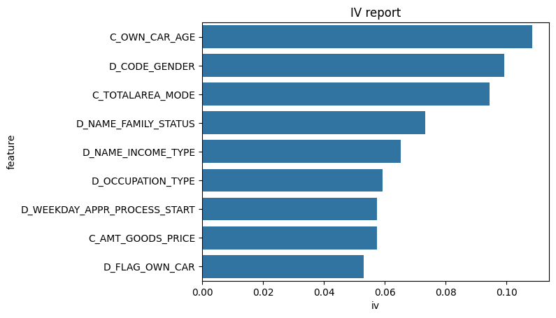

<div  id="top"></div>

  

[![Contributors][contributors-shield]][contributors-url]

[![Forks][forks-shield]][forks-url]

[![Stargazers][stars-shield]][stars-url]

[![Issues][issues-shield]][issues-url]

[![GPLv3 License][license-shield]][license-url]

[![LinkedIn][linkedin-shield]][linkedin-url]

  

<h3  align="center">Credit Scoring Toolkit</h3>

  

<p  align="center">

In finance is a common practice to create risk scorecards to assess the credit worthiness for a given customer. Unfortunately, out of the box credit scoring tools are quite expensive and scatter, that's why we created this toolkit: to empower all credit scoring practicioners and spread the use of weight of evidence based scoring techniques for alternative uses cases (virtually any binary classification problem).

<br />
<a href="docs/build/html/index.html"><strong>Explore the documentation»</strong></a>
<br />
<a href="https://github.com/JGFuentesC/woe_credit_scoring/issues">Report Bug</a>

<a href="https://github.com/JGFuentesC/woe_credit_scoring/issues">Request Feature</a>
</p>
</div>
 


<details>
<summary>Table of Contents</summary>
<ol>
  <li><a href="#about-the-project">About The Project</a></li>
  <ol>
    <li><a href="#discretenormalizer">Discrete Normalizer</a></li>
    <li><a href="#discretizer">Discretizer</a></li>
    <li><a href="#woeencoder">WoeEncoder</a></li>
    <li><a href="#woebasefeatureselector">WoeBaseFeatureSelector</a></li>
    <li><a href="#woecontinuousfeatureselector">WoeContinuousFeatureSelector</a></li>
    <li><a href="#woediscretefeatureselector">WoeDiscreteFeatureSelector</a></li>
    <li><a href="#creditscoring">CreditScoring</a></li>
    <li><a href="#built-with">Built With</a></li>
  </ol>
  <li><a href="#installation">Installation</a></li>
  <li><a href="#usage">Usage</a></li>
  <li><a href="#contributing">Contributing</a></li>
  <li><a href="#license">License</a></li>
  <li><a href="#contact">Contact</a></li>
  <li><a href="#citing">Citing</a></li>
  <li><a href="#acknowledgments">Acknowledgments</a></li>
</ol>
</details>


## About The Project

The general process for creating Weight of Evidence based scorecards is illustrated in the figure below :
  


For that matter, we implemented the following classes to address the necesary steps to perform
credit scoring transformation:

### DiscreteNormalizer
Class for normalizing discrete data for a given relative frequency threshold
### Discretizer
Class for discretizing continuous data into bins using several methods
### WoeEncoder
Class for encoding discrete features into Weight of Evidence(WoE) transformation
### WoeBaseFeatureSelector
Base class for selecting features based on their WoE transformation and 
Information Value statistic. 
### WoeContinuousFeatureSelector
Class for selecting continuous features based on their WoE transformation and 
Information Value statistic. 
### WoeDiscreteFeatureSelector
Class for selecting discrete features based on their WoE transformation and 
Information Value statistic.
### CreditScoring
Implements credit risk scorecards following the methodology proposed in 
Siddiqi, N. (2012). Credit risk scorecards: developing and implementing intelligent credit scoring (Vol. 3). John Wiley & Sons.

### Built With

* [Python](https://www.python.org/)
* [Numpy](https://numpy.org/)
* [Pandas](https://pandas.pydata.org/)
* [Jupyter](https://jupyter.org/)
* [Scikit-Learn](https://scikit-learn.org/stable/)
* [Matplotlib](https://matplotlib.org/)
* [Seaborn](https://seaborn.pydata.org/)
* [SciPy](https://scipy.org/)

<p  align="right">(<a  href="#top">back to top</a>)</p>

<!-- GETTING STARTED -->

## Installation

You can simply install the module using pip

* pip

```sh

pip install woe-credit-scoring

```


<p  align="right">(<a  href="#top">back to top</a>)</p>

## Usage

The new `AutoCreditScoring` class provides a streamlined way to train a credit scoring model, generate reports, and make predictions. Here's a quick example of how to use it:

### Dependencies

```python
import pandas as pd 
from CreditScoringToolkit import AutoCreditScoring
import warnings
warnings.filterwarnings("ignore", category=UserWarning, module="sklearn.preprocessing._discretization")
```

### Reading example data

```python
# Read example data for train and validation (loan applications)
train = pd.read_csv('example_data/train.csv')
valid = pd.read_csv('example_data/valid.csv')   
```

### Defining feature type

```python
# Assign features lists by type
vard = [v for v in train.columns if v.startswith('D_')]
varc = [v for v in train.columns if v.startswith('C_')]
```

### Automated Credit Scoring

The `AutoCreditScoring` class handles the entire workflow, from feature selection and WoE transformation to model training and scoring.

```python
# If you prefer, use AutoCreditScoring class to perform all the steps in a single call with additional features
# like outlier detection and treatment, feature selection, reporting and more.
from CreditScoringToolkit import AutoCreditScoring

kwargs = {'iv_feature_threshold':0.05,
          'max_discretization_bins':6,
          'strictly_monotonic':True,
          'create_reporting':True,
          'discretization_method':'dcc'}
acs = AutoCreditScoring(train,'TARGET',varc,vard)
acs.fit(**kwargs)

# You can also save the reports to a folder in PNG format
acs.save_reports('reports')
```

This will generate several reports, including:

-   Score distribution histograms and KDE plots
-   Event rate by score range plots
-   Feature importance based on Information Value
-   ROC curve for the model





### Making Predictions

Once the model is trained, you can use the `predict` method to score new data.

```python
predictions = acs.predict(valid)
predictions.head()
```

This will return a DataFrame with the individual point contributions for each feature (`pts_*` columns) and the final score.

<p  align="right">(<a  href="#top">back to top</a>)</p>


<!-- CONTRIBUTING -->

## Contributing

If you have a suggestion that would make this better, please fork the repo and create a pull request. You can also simply open an issue with the tag "enhancement".

Don't forget to give the project a star! Thanks again!
  
1. Fork the Project

2. Create your Feature Branch (`git checkout -b feature/AmazingFeature`)

3. Commit your Changes (`git commit -m 'Add some AmazingFeature'`)

4. Push to the Branch (`git push origin feature/AmazingFeature`)

5. Open a Pull Request

<p  align="right">(<a  href="#top">back to top</a>)</p>
  
## License

Distributed under the GNU General Public License v3.0 License. See `LICENSE` for more information.
<p  align="right">(<a  href="#top">back to top</a>)</p>

## Contact

José G Fuentes - [@jgusteacher](https://twitter.com/jgusteacher) - jose.gustavo.fuentes@comunidad.unam.mx
  

Project Link: [https://github.com/JGFuentesC/woe_credit_scoring](https://github.com/JGFuentesC/woe_credit_scoring)

<p  align="right">(<a  href="#top">back to top</a>)</p>

## Citing  
If you use this software in scientific publications, we would appreciate citations to the following paper:

[Combination of Unsupervised Discretization Methods for Credit Risk](https://journals.plos.org/plosone/article/authors?id=10.1371/journal.pone.0289130) José G. Fuentes Cabrera, Hugo A. Pérez Vicente, Sebastián Maldonado,Jonás Velasco

<p  align="right">(<a  href="#top">back to top</a>)</p>

## Acknowledgments


* [Siddiqi, N. (2012). Credit risk scorecards: developing and implementing intelligent credit scoring (Vol. 3). John Wiley & Sons.](https://books.google.com.mx/books?hl=es&lr=&id=SEbCeN3-kEUC&oi=fnd&pg=PT7&dq=siddiqi&ots=RvTR0RbOlQ&sig=_V4Iz1q_Hi_GwLAxrp-7tuHrOWY&redir_esc=y#v=onepage&q=siddiqi&f=false). For his amazing textbook.

* [@othneildrew](https://github.com/othneildrew/Best-README-Template). For his amazing README template

* [Demo data](https://www.kaggle.com/code/gauravduttakiit/risk-analytics-in-banking-financial-services-1/data). For providing example data.
  

<p  align="right">(<a  href="#top">back to top</a>)</p>


  
  

<!-- MARKDOWN LINKS & IMAGES -->

<!-- https://www.markdownguide.org/basic-syntax/#reference-style-links -->

[contributors-shield]: https://img.shields.io/github/contributors/JGFuentesC/woe_credit_scoring.svg?style=for-the-badge

[contributors-url]: https://github.com/JGFuentesC/woe_credit_scoring/graphs/contributors

[forks-shield]: https://img.shields.io/github/forks/JGFuentesC/woe_credit_scoring.svg?style=for-the-badge

[forks-url]: https://github.com/JGFuentesC/woe_credit_scoring/network/members

[stars-shield]: https://img.shields.io/github/stars/JGFuentesC/woe_credit_scoring.svg?style=for-the-badge

[stars-url]: https://github.com/JGFuentesC/woe_credit_scoring/stargazers

[issues-shield]: https://img.shields.io/github/issues/JGFuentesC/woe_credit_scoring.svg?style=for-the-badge

[issues-url]: https://github.com/JGFuentesC/woe_credit_scoring/issues

[license-shield]: https://img.shields.io/github/license/JGFuentesC/woe_credit_scoring.svg?style=for-the-badge

[license-url]: https://github.com/JGFuentesC/woe_credit_scoring/blob/master/LICENSE.txt

[linkedin-shield]: https://img.shields.io/badge/-LinkedIn-black.svg?style=for-the-badge&logo=linkedin&colorB=555

[linkedin-url]: https://linkedin.com/in/josegustavofuentescabrera


  

